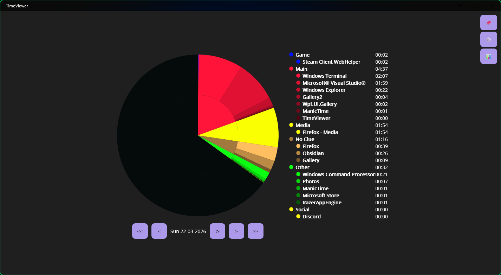
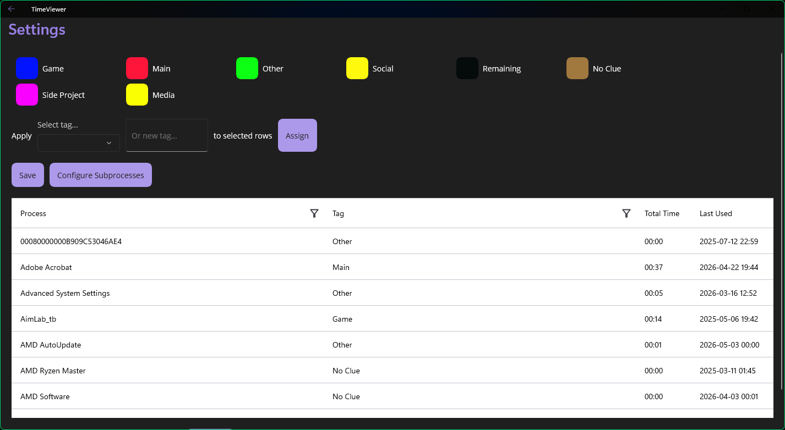
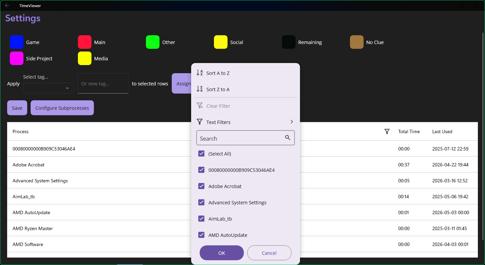
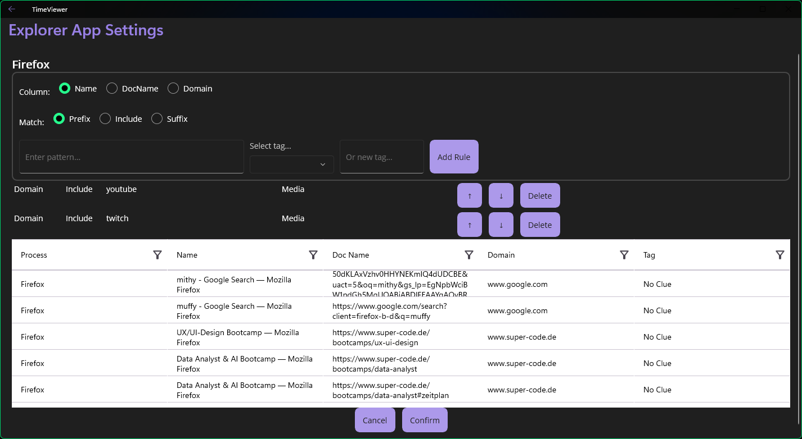

# Time Management

I find it fascinating to discover patterns in everything, including my own life. 
Time Management is a system I built to observe my own behavior and understand how I actually spend my time on the PC each day.

To track myself, I use ManicTime (https://www.manictime.com/), which records the active window throughout the day. **This app is dependant on ManicTime's Data!**  You need to also install their App for mine to work!

While it already provides some built-in views, it can still be hard to get a quick and clear picture of how long you actually work.

TimeViewer is a Windows desktop app built with .NET MAUI that solves this. It pulls raw app-usage data from ManicTime and lets you organise it through two layers of customisation:

1. Tag rules: map each process (e.g. outlook.exe) to a category like "Work" or "Gaming".
2. Explorer rules: for multi-purpose apps like browsers, apply pattern-matching rules on the open document or URL to assign more specific sub-tags (e.g. a browser tab titled "GitHub" → "Work").

The result is displayed as an interactive nested pie chart you can navigate day by day to analyse your own behaviour.

For the larger picture, [Analysis](./Analysis/) provides several Python scripts to identify longer-term trends. My goal is to eventually surface these statistics in the app as well.

---
Home Page

Assigning processes to tags.

Easy searchability. Initial setup can be cumbersome, but the results are fantastic!

Some apps are more complex. Apps like Firefox or Chrome can be used in many different ways — for those, more refined Explorer rules can be assigned.
